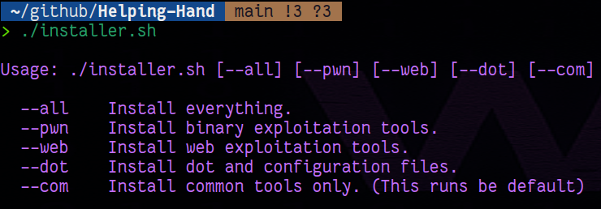
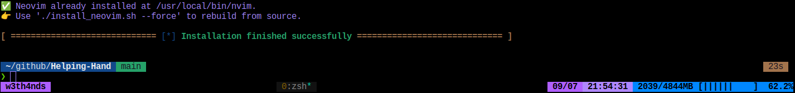

<div align="center">
  <h1>
    Helping Hand
  </h1>
</div>

<div align="center">
  
</div>

If you are an **Ubuntu** user that:

* Constantly break their VMs. 
* Have multiple machines with chaotic configurations.
* A bit interested in CTFs and Binary exploitation.

This repo contains a quick installer for basic **Binary Exploitation (pwn)**, **Web Exploitation** and **CTF** stuff, some of my *dotfiles* and things that make my Ubuntu machine less miserable. 

### 1. Benefits

* Nice UI.
* Basic (and not only) hacking tools included.
* `nvim` configuration
* Aliases (see `~/.zshrc`)
* Auto-suggestion.
* Icons (if icons are not shown correctly, remove the alias `exa --icons` from your `~/.zshrc` file).
* Cool `tmux` plugins.
* Fonts.
* `pusher` function for fast commits `pusher 'my msg'`
* `trans N` command to change transparency of terminal. 

### 2. Github SSH-keygen (optional)

Create SSH keys for github:

```bash
bash <(wget -qO- https://raw.githubusercontent.com/w3th4nds/Helping-Hand/main/ssh_key_git.sh) -u "username" -e "your@mail"
```

### 3. Installation

### 3.1 Automated

Run:
```bash
bash <(wget -qO- https://raw.githubusercontent.com/w3th4nds/Helping-Hand/main/installer.sh) --all
```

Instead of `--all`, you can use other options to reduce installation size :

* `--pwn` -> For binary exploitation tools.
* `--web` -> For web exploitation tools.

* `--com` -> For basic tools.
* `--dot` -> For my dotifiles.

The `--com` option is by default and runs with **every option**. 

⚠️ *If `wget` is not installed by default, run `sudo apt install -y wget `* ⚠️

 ### 3.2 Manually

Git clone the repo (web URL): 

```bash
git clone https://github.com/w3th4nds/Helping-Hand.git
```

or with SSH:

```bash
git clone git@github.com:w3th4nds/Helping-Hand.git
```

Execute the script with one or more of the options:

```bash
./installer.sh --all
```

If no options are provided, you see this message: 



If everything went smoothly, you should see this message: 



After you finish, update the .zshrc with 

```bash
source ~/.zshrc
```


